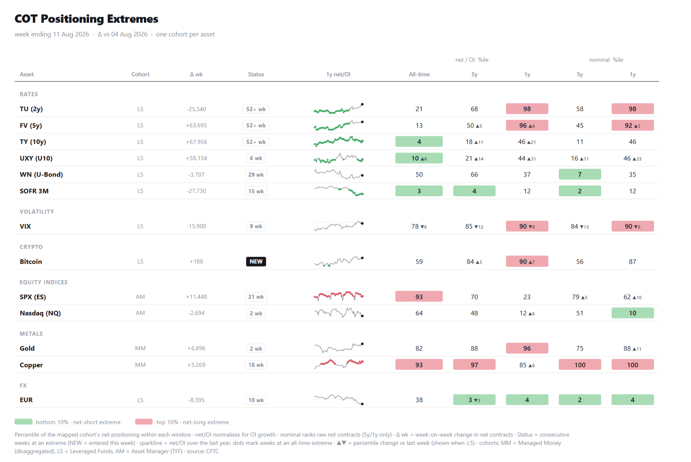

# COT Positioning Extremes Dashboard

A single-file Python script that pulls CFTC Commitments of Traders data and
renders a positioning-percentile dashboard, flagging where the "smart
speculator" cohort in each market is at a historical extreme.



## What it shows

For each futures market, one cohort is mapped (mirroring the convention used by
most positioning dashboards):

| Report | Cohort | Used for |
|---|---|---|
| Traders in Financial Futures | Leveraged Funds (LS) | rates, FX, VIX, crypto |
| Traders in Financial Futures | Asset Manager (AM) | equity indices |
| Disaggregated | Managed Money (MM) | metals, energy, grains, softs |

The cohort's **net position** (long − short) is ranked as a percentile within
three windows:

- **net / OI** (net position divided by total open interest, so growth in the
  contract doesn't distort history): all-time, 5-year, 1-year
- **nominal** (raw net contracts): 5-year, 1-year

Anything at or below the 10th percentile is a net-short extreme (green);
anything at or above the 90th is a net-long extreme (red). Also shown:

- **Δ wk** — week-on-week change in net contracts
- **Status** — consecutive weeks at an extreme; `NEW` = entered this week
- **1y net/OI sparkline** — dots mark weeks at an all-time extreme
- **▲/▼** — week-on-week change in the percentile itself (when ≥ 5 points)

## Install

Python 3.9+. Only two dependencies:

```bash
pip install -r requirements.txt
```

## Run

```bash
python cot_dashboard.py                    # full board -> cot_dashboard.html
python cot_dashboard.py --extremes-only    # only rows currently at an extreme
python cot_dashboard.py --threshold 5      # tighter definition (5th/95th)
python cot_dashboard.py --combined         # futures + options combined reports
python cot_dashboard.py --search wheat     # find CFTC contract codes by name
python cot_dashboard.py --mock             # synthetic data, no network
```

Open the resulting HTML file in a browser.

## Adding / removing markets

Edit the `MARKETS` list near the top of `cot_dashboard.py`. Each entry is:

```python
("Display name", "GROUP", "tff" | "disagg", "CFTC code", "lev" | "am" | "mm"),
```

Comment a line out to drop it. To add a market, find its code with
`--search`, e.g. `python cot_dashboard.py --search "soybean"`, and paste it in.
Financial contracts live in the `tff` dataset; physical commodities in
`disagg`.

## Data

Source is the CFTC's public open-data API (publicreporting.cftc.gov, Socrata).
No key required. Data is weekly, snapshotted each **Tuesday** and released
**Friday 3:30pm ET** — so the freshest data on a Saturday is the previous
Tuesday's. History goes back to June 2006 for both reports.

Anonymous API access is rate-limited on a shared pool; a weekly run will never
hit it. If you hammer it while backfilling, register a free Socrata app token
and add it as an `X-App-Token` header in `fetch()`.

## Automating

Run it after each Friday release. On Windows, Task Scheduler pointing at
`python C:\path\to\cot_dashboard.py --extremes-only` on Saturday mornings.
On Mac/Linux, a cron line such as:

```
0 8 * * 6  cd /path/to/repo && python cot_dashboard.py --extremes-only
```

## Caveats

- Crypto rows are **CME-only** positioning — a narrow, TradFi-institutional
  slice of the market. Pair with exchange OI / funding data for the full picture.
- Leveraged-fund Treasury shorts include basis-trade positioning, so a
  record short in TY does not necessarily mean a directional bearish view.
- With three windows per row, the 1-year window flags easily — something is
  always near its 52-week high or low. The all-time net/OI column and the
  Status/streak column are the more meaningful signals.
- Percentiles are inclusive rank of the current value within the window, so a
  fresh all-time high prints 100.

## Licence

MIT — see `LICENSE`.
